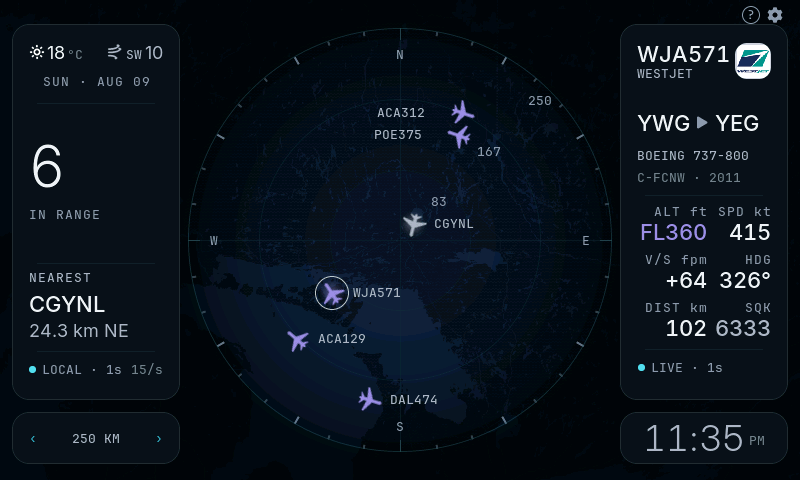
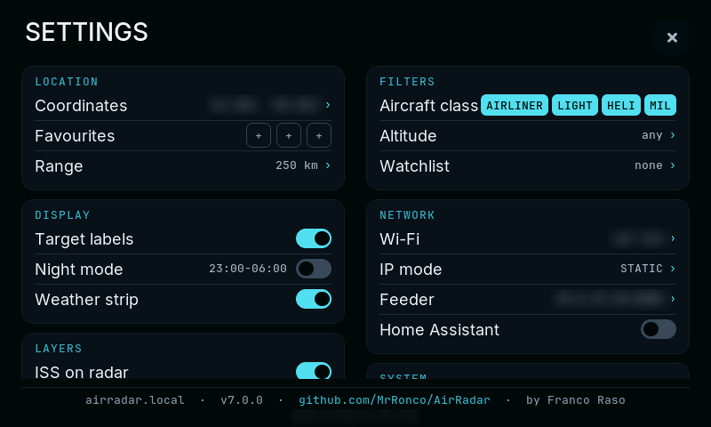
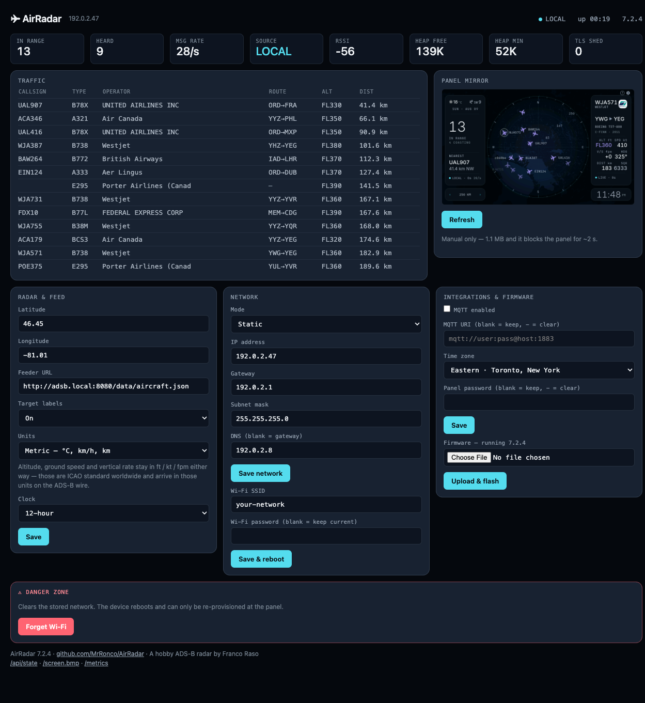

<div align="center">

# AirRadar

**A real-time ADS-B air-traffic radar that runs entirely on an ESP32-S3 touchscreen.**

No cloud account. No API key. No companion app. Point it at your own receiver and it
draws the sky above your house on a 7-inch panel.

[](docs/HISTORY.md) [](docs/HARDWARE.md) [](https://lvgl.io) [](#data-sources) [](https://mrronco.github.io/AirRadar/flasher/) [](LICENSE)



<sub>Live capture straight off the device via <code>GET /screen.bmp</code> — the actual framebuffer, not a mockup.</sub>

</div>

---

## What it does

AirRadar turns a Waveshare 7-inch ESP32-S3 touch panel into a standalone radar scope.
It polls **your own ADS-B receiver** twice a second, dead-reckons every target between
polls so the picture stays smooth, and enriches what it sees from a handful of keyless
public APIs — airline, route, airframe, weather.

It is a finished appliance, not a demo sketch. Provisioning, network config, OTA
updates, a web console, Home Assistant integration and persistent caches all live on
the device. The only things you supply are Wi-Fi and coordinates.

| | |
|---|---|
| **Feeder-first** | Reads `aircraft.json` from any readsb/tar1090 feeder (adsb.im, PiAware, dump1090-fa) at 2 s. Falls back to airplanes.live automatically and snaps back on its own. |
| **It never stops moving** | Targets are dead-reckoned from heading and ground speed between polls. Lose a report and the glyph goes translucent and *coasts* along its last vector before dropping at 60 s. |
| **Reads at a glance** | Glyph colour encodes altitude band, glyph size encodes proximity, a white ring marks selection, a square marks military, gold marks your watchlist. |
| **Real base map** | CARTO dark tiles stitched on-device into one 800×480 image behind the whole screen, dimmed outside your coverage radius so the disc still reads as the instrument. |
| **Knows the flight** | Airline logo and name, origin → destination, airframe type, registration and year — resolved lazily and cached to flash so they survive a reboot. |
| **Runs headless too** | JSON API, Prometheus metrics, live screenshot endpoint, MQTT with Home Assistant auto-discovery, and OTA firmware upload over the network. |

---

## Screens

<div align="center">


<sub><b>The coverage lens.</b> The map covers all 800×480, but everything outside your receiver's range is dimmed with a feathered falloff — so the scope still reads as a disc without drawing a hard edge across the geography.</sub>

</div>

**Tap any target** to pin it. The right-hand card fills in with the operator tile,
route, airframe, and a live instrument grid — altitude or flight level, speed, heading,
vertical rate, distance and squawk — plus a seconds-since-last-report counter, so you
always know how fresh the picture is.

**Tap `?`** for the legend. It is deliberately *not* a manual: it explains only what the
display **encodes** — what the colours, sizes, dimming, rings and dots mean — because
anything the panel already labels needs no explanation.

**Everything is configurable on-device.** First boot scans for Wi-Fi and gives you a
three-layer touch keyboard; coordinates go in on a numpad. After that nothing needs a
computer — the whole settings tree lives behind the gear.

<div align="center">



<sub>Settings on the panel. Location, favourites and range; display and layer toggles;
class, altitude and watchlist filters; Wi-Fi, static IP, feeder URL and Home Assistant.
The footer stays pinned while the columns scroll. Personal values blurred.</sub>

</div>

---

## The web console

Open `http://airradar.local/` from a computer. This is a management console, not a
phone app — it assumes a desktop and lays out on a fixed 1240 px grid.

<div align="center">



<sub>Live, with the panel mirror loaded. Coordinates are blurred; the heap tiles show a device 30 minutes into a boot — see the <a href="#roadmap">known heap drain</a>.</sub>

</div>

The status strip and traffic table poll `/metrics` and `/api/state` live, and both
**stop polling when the tab is hidden** — this is a microcontroller, and a forgotten
background tab is a real load. The panel mirror is manual-only for the same reason: it
is a 1.1 MB BMP and it blocks the display for about two seconds.

### API

Everything sits behind HTTP Basic auth (`admin` + your panel password) once a password
is set, with an exact-origin CSRF guard on writes.

| Endpoint | Purpose |
|---|---|
| `GET /api/state` | Full track list + device state as JSON |
| `GET` / `POST /api/config` | Read or write every setting |
| `GET /metrics` | Prometheus format, including `heap_free` / `heap_min` / `heap_largest` |
| `GET /screen.bmp` | The live 800×480 framebuffer as a BMP |
| `GET /api/probe?url=` | Device-side fetch test — settles "is it my firewall or your firmware?" |
| `POST /update` | OTA firmware upload |

```bash
curl -s http://airradar.local/api/state | jq '.tracks[0]'
curl -F "update=@firmware/airradar-ota.bin" http://airradar.local/update
```

### Home Assistant

Enable MQTT in Integrations and AirRadar publishes retained discovery configs, so six
sensors — aircraft in range, aircraft heard, feed rate, source, nearest aircraft and
nearest distance — plus an **emergency squawk** binary sensor in the `safety` device
class appear in Home Assistant with no YAML.

---

## Hardware

One board. Nothing to solder, nothing to wire, no enclosure required to get started.

### The Waveshare ESP32-S3-Touch-LCD-7

> **[Buy the board on Amazon →](https://link.amazon/B03ZNSVCZ)** (Amazon.ca)
>
> **As an Amazon Associate I earn from qualifying purchases.** That link is an affiliate
> link: it costs you nothing extra and helps fund this project.
>
> <sub>Outside Canada, or if you would rather not use an affiliate link, the board is sold
> directly by [Waveshare](https://www.waveshare.com/esp32-s3-touch-lcd-7.htm) and through
> the usual distributors.</sub>

Everything runs on a single **Waveshare ESP32-S3-Touch-LCD-7 (Rev 1.2)** — a 7-inch
capacitive touchscreen with the microcontroller already on the back of the panel. It
arrives as one assembled unit — roughly US$50–70 depending on the seller at the time of
writing. Plug in USB-C and it boots.

| | |
|---|---|
| **MCU** | ESP32-S3-WROOM-1-**N16R8** — dual-core Xtensa LX7 @ 240 MHz, Wi-Fi + BLE |
| **Flash** | 16 MB QIO — split 3 MB app / 9.9 MB FATFS for the on-device caches |
| **PSRAM** | **8 MB OPI** — this is the part that makes the project possible |
| **Display** | 7" IPS, 800×480, **RGB565 parallel** interface |
| **Touch** | GT911 five-point capacitive, over I²C |
| **Also on board** | CH422G I/O expander, CH343P USB-UART, microSD slot, RS485, CAN, battery header, spare I²C/UART headers |
| **Power** | USB-C, roughly 500 mA in normal use |

**Why this board specifically.** The two things that matter are the *parallel* display
interface and the 8 MB of PSRAM, and they go together. An SPI display cannot move
800×480×16 bits fast enough to redraw a live map; the RGB parallel bus can, because the
panel's DMA scans a framebuffer held in PSRAM continuously. That framebuffer is 768 KB,
which is why 8 MB of PSRAM rather than 2 MB is the deciding spec. The 16 MB flash then
leaves nearly 10 MB of FATFS free for the map, logo and route caches — enough that the
device draws a full base map about five seconds after power-on, before Wi-Fi has even
associated.

That same DMA is also the project's central engineering constraint: it consumes most of
the available PSRAM bandwidth all the time, so every pixel the CPU writes is competing
with the panel refresh. Nearly every performance rule in this codebase traces back to it.

### Quirks worth knowing before you buy

Honest notes, all learned the hard way:

- **The backlight is on/off only.** There is no PWM dimming on this board, so night mode
  turns the panel off rather than dimming it.
- **There is a UART slide switch** on the board that gates flashing. In the wrong
  position you get *"No serial data received"* and nothing else. It catches everyone once.
- **The GT911 touch address latches at reset** from the INT pin. Left floating it comes
  up at either 0x5D or 0x14, more or less at random per power cycle. The firmware pins it
  deterministically, but a board sample with dead touch just needs the alternate address.
- **On macOS you need the CH343 driver** — `brew install --cask wch-ch34x-usb-serial-driver`,
  which wants Rosetta on Apple Silicon.

> [!IMPORTANT]
> **The PSRAM setting is not optional.** It must be **OPI PSRAM**. Set wrong, the
> framebuffer fails to allocate and you get a black screen or a boot loop. It is the
> first thing to check on any "the screen is dead" report.

### The rest of the bill of materials

| Part | Notes |
|---|---|
| USB-C cable and a 5 V supply | Power and flashing. ~500 mA. |
| An ADS-B receiver on your LAN | *Optional.* Without one it runs entirely on airplanes.live. A Raspberry Pi running [adsb.im](https://adsb.im) with an RTL-SDR dongle is the usual pairing. |
| A stand or frame | *Optional.* The board has mounting holes; it sits fine on a desk stand. |

Full pin map, panel timings, the GT911 reset sequence and the I²C expander details are
in [`docs/HARDWARE.md`](docs/HARDWARE.md).

---

## Install

### One-click (recommended)

Open the **[web flasher](https://mrronco.github.io/AirRadar/flasher/)** in Chrome or Edge, plug in USB-C, hit **Install**. It
writes a merged image — bootloader, partition table and app — so there is nothing else
to configure.

> [!TIP]
> If the flasher reports *"No serial data received"*, flip the **UART slide switch** on
> the board. It has caught everyone at least once.

### From source

See [`firmware/BUILD.md`](firmware/BUILD.md) for exact steps. The short version:

```bash
FQBN='esp32:esp32:esp32s3:CDCOnBoot=cdc,FlashMode=qio,FlashSize=16M,\
PartitionScheme=app3M_fat9M_16MB,PSRAM=opi,UploadSpeed=921600'

arduino-cli compile --fqbn "$FQBN" firmware/AirRadar
arduino-cli upload  --fqbn "$FQBN" -p /dev/cu.wchusbserial* firmware/AirRadar
```

Pinned dependencies — **do not casually upgrade these**, each pin is load-bearing:

| Library | Version | Why pinned |
|---|---|---|
| esp32 Arduino core | 3.3.10 | Partition and FQBN option names shift between releases |
| LVGL | 8.3.11 | v9 changed the object and style API wholesale |
| LovyanGFX | 1.2.25 | RGB panel + GT911 driver behaviour is verified against this |
| ArduinoJson | 6.21.6 | Code uses `DynamicJsonDocument`, which v7 removes |
| PubSubClient | 2.8 | — |

`firmware/lv_conf.h` must be copied next to the LVGL library folder. LVGL will not find
it otherwise, and the failure mode is a confusing wall of missing-symbol errors.

### First boot

1. The panel scans for Wi-Fi. Pick your network, type the password on the touch keyboard.
2. Enter your latitude and longitude on the numpad. This is the centre of the scope.
3. Open `http://airradar.local/` and set your **Feeder URL**
   (`http://<your-pi>:8080/data/aircraft.json`).

That is the whole setup. Everything else has a working default.

---

## Data sources

Every source is keyless and free. Nothing about you is sent anywhere — the aircraft
data path is your antenna to your panel.

| Source | Used for | Cadence |
|---|---|---|
| Your feeder (readsb/tar1090) | Aircraft — **primary** | 2 s |
| [airplanes.live](https://airplanes.live) | Aircraft — automatic fallback | 8 s |
| [adsbdb](https://www.adsbdb.com) | Airline name, origin → destination | Lazy, cached to flash |
| [Open-Meteo](https://open-meteo.com) | Local conditions and wind | ~15 min |
| [CARTO](https://carto.com/basemaps) | Dark base map tiles | Once per {lat, lon, range} |
| [esp32flight-logos](https://github.com/theqkash/esp32flight-logos) | Airline logos | On demand, cached to flash |
| open-notify | ISS overhead | 15 s |

The 8 s fallback interval is **API courtesy** — airplanes.live is free and unmetered, so
please do not tighten it. Your own feeder is polled at 2 s because it is yours.

---

## How it works

<details>
<summary><b>Architecture</b> — threading, rendering, and where the caches live</summary>

<br>

**Threading contract.** `loop()` on core 1 owns everything mutable: all LVGL calls, the
track array, and NVS. Network runs as short-lived tasks on core 0 that write into
pending buffers under a `portMUX`. No network task ever touches a track or an LVGL
object. This one rule is why the display never tears during a fetch.

```
core 1  loop()  ──▶ LVGL render · touch · tracks[] · NVS · MQTT
                     ▲
                     │ pending buffers, guarded by g_dataMux
                     │
core 0  tasks   ──▶ feeder · routes · weather · map tiles · logos
```

**Rendering is event-driven.** There is no refresh loop. The RGB panel's DMA scans the
PSRAM framebuffer continuously at roughly 25 MB/s, and that is most of the available
bandwidth — so every widget write is change-cached and nothing repaints unless the
value actually changed.

**Three FATFS caches**, because the network is the fragile part:

- `/mp/r<km>` — the stitched base map, keyed by location. It only depends on
  `{lat, lon, range}`, so it is fetched once and reused indefinitely. The map is on
  screen about 5 seconds after boot, *before Wi-Fi finishes associating.*
- `/lg/<ICAO>` — airline logos, with a 24-slot RAM tier in front.
- `/rt/tbl` — resolved routes. A callsign's route is static, so caching it means origin
  and destination survive both a reboot and a network outage.

**Track lifecycle.** Fresh under 20 s draws a solid glyph. From 20–60 s it goes
translucent and *coasts* — position extrapolated from the last known heading and speed.
Past 60 s it drops. Selection is held by ICAO hex, so it survives every refresh and
clears only when the aircraft is genuinely gone.

</details>

<details>
<summary><b>Hard-won lessons</b> — the bugs that shaped this codebase</summary>

<br>

Every non-negotiable rule in [`CLAUDE.md`](CLAUDE.md) is a real debugging session. The
interesting ones:

**The wiggle.** The whole image sheared intermittently. Root cause: `lv_obj_add_flag`
and `clear_flag` invalidate the object *unconditionally* — even when the flag already
held that value. A `setHidden()` call ran every tick on the map image, repainting a
392×392 region four times a second into a PSRAM bus the panel DMA already needed. It
only ever appeared once a base map existed, which is why it looked intermittent. Fix:
change-cache every write, flags included.

**A 96 KB draw buffer that broke the network.** Internal SRAM settled at ~17 KB, which
is permanently below the TLS floor, so routes, weather and new logos were shed forever
and the device eventually rebooted. Worse, below the floor each optional fetch *still*
spawned a 12 KB-stack task just to discover the gate was shut — about 80 no-op
create/destroy cycles a minute, which was itself the fragmentation engine pinning the
largest free block at 10 KB. Halving the buffer and checking the gate in loop context
took free heap from **17 KB to 159 KB** and the largest block from 10 KB to 65 KB.

**`setSwapBytes(true)` silently disabled the fast path.** With the flag on, LovyanGFX
resolves `pushImage` through a pixelcopy specialisation that sets `no_convert = false`
and skips `Panel_FrameBufferBase::writeImage`'s per-row `memcpy` — so every flushed
pixel became an individual convert-and-store into PSRAM. Byte-swapping ourselves in
internal SRAM first keeps the bulk copy.

**The GT911 touch address is a coin flip.** It latches from the INT pin at reset, so
left floating it comes up at 0x5D or 0x14 more or less at random per power cycle. The
CH422G init does a controlled reset — INT driven low while TP_RST pulses — pinning
0x5D every boot.

**Three heap hypotheses that were wrong.** A slow internal-heap drain was blamed on
per-TLS-connection leakage, then TIME_WAIT socket exhaustion, then missing feeder
keep-alive. All three were measured, all three were falsified, and all three are
written down in [`docs/V7_PORT.md`](docs/V7_PORT.md) specifically so nobody retries
them. The drain tracks feeder poll count and is still open — the flash caches
*neutralised* it rather than fixed it, and the honest next step is real heap tracing
rather than a fourth guess.

</details>

<details>
<summary><b>The v7.1 design pass</b> — what a formal UI audit changed</summary>

<br>

v7.1 acted on [`UI_UX_REVIEW.md`](UI_UX_REVIEW.md), a full design audit that scored the
panel **3.9/10**. The headline finding: the radar was not the hero of its own display.
The SETTINGS button measured **7.26× denser and 14.7× brighter** than the entire scope,
and chrome outweighed the disc 1.26 : 1 by area. It is now 0.82 : 1.

The fixes were measured rather than stylistic:

- Card shadows bought **1.009 : 1** of contrast for a 3.4 KB uncached buffer plus two
  blur passes per card per repaint. Deleted.
- Card opacity at 216 forced `LV_COVER_RES_NOT_COVER`, recompositing the screen root
  beneath every 1 Hz label, for a **1.057 : 1** visual difference. Cards are now opaque.
- Values went 20 → 22 px to clear the 16-arcminute ISO 9241-303 legibility floor at a
  650 mm viewing distance, and tabular figures were frozen into Inter with
  `pyftfeatfreeze` so live numbers stop shimmying as digits change.
- Eight type faces became six.

And one genuine safety bug: `altColorRGB`'s unknown-altitude branch returned a value
byte-identical to the emergency red, so an aircraft reporting no altitude was
indistinguishable from a 7700 squawk. Unknown is now ivory. Red belongs to emergencies
alone.

</details>

---

## Repo layout

```
firmware/AirRadar/       v7 LVGL application — ~7,400 lines of C++ across 29 files
  src/core/                state, track lifecycle, dead reckoning
  src/net/                 feeder, enrichment, map tiles, logos
  src/ui/                  scope, cards, settings, legend, theme
  src/svc/                 web console + API, MQTT
  src/hal/                 display, touch, backlight
firmware/tools/          asset and font generation
flasher/                 ESP Web Tools one-click installer (GitHub Pages)
docs/                    hardware notes, port log, history, roadmap
AirRadar.ino             legacy v6 single-sketch app, kept as reference
CLAUDE.md                project context + every non-negotiable rule
UI_UX_REVIEW.md          the full design audit behind v7.1
```

`AirRadar.ino` at the root is **v6** — the original single-file immediate-mode app. It
is kept because it is the proven reference for the hardware bring-up and data logic that
v7 was ported from. New work goes in `firmware/AirRadar/`.

---

## Roadmap

Shipped in v7.1: full-bleed map · spatial label decluttering · FATFS map and route
caches · legend overlay · desktop web console · six-face type scale with tabular figures.

Still open — see [`docs/ROADMAP.md`](docs/ROADMAP.md):

- Route ETA and a session-statistics screen
- A served `/live` page in the web console
- Shipping the logo pack pre-loaded to FATFS at flash time

**Known open bug: a slow internal-heap drain.** Free internal SRAM falls at roughly
70 B/s from boot and does not recover. A device measured at 27 minutes of uptime sat at
17 KB free with a largest free block of 8.7 KB — below the ~16.4 KB that an mbedTLS
handshake needs — so every optional TLS fetch is shed from then on. The flash caches
hide most of the impact, since the map, logos and routes all come from FATFS rather than
the network; what actually stops is weather refresh and first-time logo fetches. Aircraft
tracking, the local feeder and the web console are unaffected. The drain scales with
feeder poll count. Three plausible causes were tested and falsified — see
[`docs/V7_PORT.md`](docs/V7_PORT.md) — and the honest next step is heap tracing rather
than a fourth guess.

**Aircraft photos are blocked, not deferred.** Planespotters' Photo API terms require
that image binaries are loaded by the end user's browser and never stored on your own
infrastructure, plus a plain-anchor attribution link. A panel that fetches the JPEG
itself cannot comply. Rendering them browser-side in the web console *would* be
compliant, and that is the only path being considered.

---

## Built with Claude

This project was developed with **[Claude Code](https://claude.com/claude-code)**
(Anthropic) doing most of the implementation, and there is no point pretending
otherwise — so here is what that actually looked like.

The work was done against real hardware in a tight loop: flash the board, pull the panel
over `GET /screen.bmp`, read `GET /metrics`, compare against what was expected, fix,
repeat. That feedback loop is the reason the diagnostic endpoints exist at all — they
were built so the firmware could be debugged by something that cannot physically look at
the screen, and they turned out to be genuinely useful on their own.

It was not magic, and the repo is honest about that. Three separate hypotheses for the
internal-heap drain were confidently wrong — per-connection TLS leakage, then TIME_WAIT
socket exhaustion, then missing feeder keep-alive. Each was implemented, measured,
falsified and reverted. All three are written down in
[`docs/V7_PORT.md`](docs/V7_PORT.md) precisely so the next person does not spend a
session rediscovering them. The bug is still open.

[`CLAUDE.md`](CLAUDE.md) at the root is the working context file for that collaboration.
It is worth reading even if you never touch an LLM: it is the accumulated hardware truth
of this board — every non-negotiable rule in it cost a real debugging session, and it is
a more useful document than this README if you are porting to similar hardware.

Design direction, hardware decisions, priorities and the final call on every change
were the author's.

## Credits

Inspired by Mirko Pavleski's CrowPanel ADS-B radar, which was the starting point for v1
back in 2024. Nothing of that codebase remains — v7 is a ground-up LVGL application for
different hardware — but AirRadar is released under the GPL in keeping with that origin.
See [`docs/HISTORY.md`](docs/HISTORY.md) for the whole arc, wrong turns included.

Aircraft data from your own receiver and [airplanes.live](https://airplanes.live).
Routes from [adsbdb](https://www.adsbdb.com). Weather from
[Open-Meteo](https://open-meteo.com). Base map © [CARTO](https://carto.com/basemaps),
map data © [OpenStreetMap](https://www.openstreetmap.org/copyright) contributors.
Airline logos from [esp32flight-logos](https://github.com/theqkash/esp32flight-logos).
Type is [Inter](https://rsms.me/inter/) and
[JetBrains Mono](https://www.jetbrains.com/lp/mono/).

Built on real hardware by [Franco Raso](https://github.com/MrRonco), with a great deal
of measuring.

## License

**[GPL-3.0-or-later](LICENSE)** — Copyright © 2026 Franco Raso.

Use it, modify it, build on it, sell hardware with it. The one condition: if you
distribute a modified version, you publish your source under the same licence and keep
the attribution. Credit is not a courtesy here, it is the licence.

Third-party components keep their own terms — see
**[THIRD-PARTY-NOTICES.md](THIRD-PARTY-NOTICES.md)** and [`LICENSES/`](LICENSES/). Two
worth knowing about:

- The generated `font_*.c` glyph data stays under the **SIL Open Font License 1.1**, not
  the GPL — OFL requires the font software be distributed entirely under the OFL.
- The pre-built images in `flasher/` statically link LGPL-2.1 arduino-esp32 and
  Apache-2.0 Espressif components. All are GPL-3-compatible; note that Apache-2.0 is
  compatible with GPL **v3 only**, which is why this is v3-or-later and not v2.

Map imagery committed here is © [CARTO](https://carto.com/attributions), data ©
[OpenStreetMap](https://www.openstreetmap.org/copyright) contributors. That attribution
travels with any redistribution.
